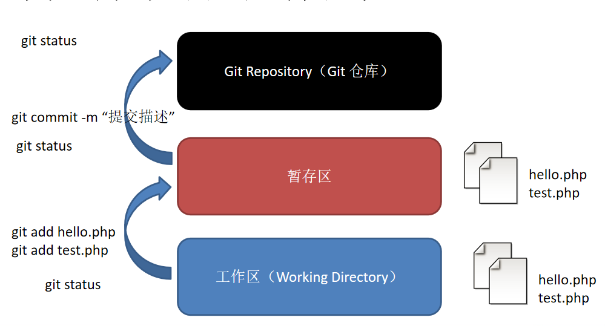

# Git基础命令

## 1.Git基础设置

- ### 设置用户名	git config --global user.name 'zlx1530268781'

- ### 设置用户邮箱 git config --global user.email '1530268781@qq.com'

- ### 查看设置        git config --list

## 2.创建一个Git仓库

- ### 	新建一个文件夹		mkdir demo

- ###     进入这个目录            cd demo

- ###     初始化（创建git仓库）git init    ==会生成一个.git隐藏文件==

## 3.Git工作区域

## 4.向仓库添加文件

- ### 创建一个文件       touch  test1.txt

- ### 添加到git暂存区    git add test1.txt

- ### 提交操作             git commit -m '提交描述'

## 5.修改文件

### 修改文件后，按照添加文件的步骤commit即可

## 6.删除文件

- ### 删除一个文件    rm  test1.txt

- ### 从git中删除    git rm test1.txt

- ### 提交操作       git commit -m '提交描述'